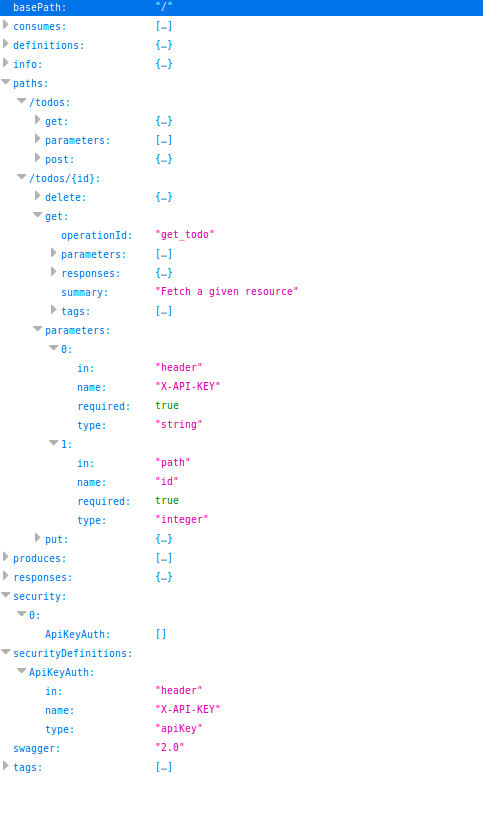

# Deployment Manager Type Provider Sample

---

Sample application demonstrating Google Cloud Deployment Manager custom API server.

Custom Type Providers allows you to define your **own** API server for provisioning tasks outside of GCP resources.

That is, you can run your own API server to perform CRUD operations along with any other GCP resource management changes and even
chain dependencies and outputs of your API server into GCP or other resources.

Deployment Manager 'knows' about your API server by consuming a swagger 2.0 specification file that you need to provide to it during setup.

- [DM Type Provider](https://cloud.google.com/deployment-manager/docs/configuration/type-providers/process-adding-api)

In this example, a very simple REST API "TODO Server" runs on AppEngine (python + Flask-RestPlus) that accepts key-values as tasks in response to DM actions.

The REST API server is protected by a static, hardcoded API key which is also transmitted by DM during its operations.

Finally, the output of of the 'add-task' operation is shown in the output so you can take actions based on that or apply them elsewhere.

---

## Run sample API server on AppEngine


The sample API server is the basic ["Flask-RestPlus"](https://flask-restplus.readthedocs.io/en/stable/) API server which automatically creates a 
swagger file DM can consume

So, the first step is to deploy the application to GAE (assuming you set a Google Cloud Account and installed the [gcloud SDK](https://cloud.google.com/sdk/downloads):

```
cd gae

pip install -t lib -r requirements.txt

gcloud app deploy app.yaml --version dmapi --no-promote
```

The step above will deploy the "TODO" server to version 'dm-api' and will not promote the app to default.

Test the APP is available (ofcourse substitute YOUR-PROJECT everywhere below for your real one) by going to 

- https://dmapi-dot-YOUR_PROJECT.appspot.com/#/todos
- https://dmapi-dot-YOUR_PROJECT.appspot.com/swagger.json

via curl:

- List Tasks:
```bash
$  curl  -X GET "https://dmapi-dot-YOUR_PROJECT.appspot.com/todos" -H 'X-API-KEY: foo'
{
    "items": []
}
```
(should show nothing, (as expected))


## Configure and Deploy Type Provider

Now that the API server is deployed, edit

```custom_type_provider.yaml``` and set the *swagger_url* parameter to your GAE endpoint's swagger file.

Then run the deployment

```bash
gcloud deployment-manager deployments create todorest --config custom_type_provider.yaml
```

Once it completes, you should see

```bash
NAME                 TYPE                                                 STATE      ERRORS  INTENT
add-task             YOUR_PROJECT/tasks-type-provider:/todos/{id}         COMPLETED  []
delete-task          YOUR_PROJECT/tasks-type-provider:/todos/{id}         COMPLETED  []
tasks-type-provider  deploymentmanager.v2beta.typeProvider                COMPLETED  []
```

### Verify Create took place

```bash
$  curl  -X GET "https://dmapi-dot-YOUR_PROJECT.appspot.com/todos" -H 'X-API-KEY: foo'
{
    "items": [
        {
            "id": 1135, 
            "task": "some task"
        }
    ]
}
```


### Delete the Task

```
gcloud deployment-manager deployments delete todorest
```

(if your API server is down during the operation for whatever reason try using the ```--delete-policy=ABANDON``` flag)


---

### Verify Delete took place

```bash
$  curl  -X GET "https://dmapi-dot-YOUR_PROJECT.appspot.com/todos" -H 'X-API-KEY: foo'
{
    "items": []
}
```


## Capturing Outputs

You can capture the output of your own API (the parts it returns in the API call, by referencing them directly in  the tempalte or as Outputs)

- [https://cloud.google.com/deployment-manager/docs/configuration/expose-information-outputs#looking_up_final_output_values](https://cloud.google.com/deployment-manager/docs/configuration/expose-information-outputs#looking_up_final_output_values)


eg, the output may look like:


## Appendix

### Google API Design Guide

Its recommended to follow the [Google API Design Guide](https://cloud.google.com/apis/design/standard_methods) when setting up
the API server

In the example here, the (Create, List) operations occur at the collection ```/todo``` while the (DELETE,GET,PUT) happens on the resource:
```/todo/{id}```.

```yaml
/todo
  post:
  get:
/todo/{id}
  get:
  delete:
  put:
```

When defining the DM template use the GET resource as the TYPE-Provider:
```yaml

```


### Flask Rest-Plus UI

The library used has a very nice UI for testing too which you can access at the root path of your API server

### Cloud Endpoints
You may also want to use [Cloud Endpoints](https://cloud.google.com/endpoints/) if running elsewhere or developing a new API!:

