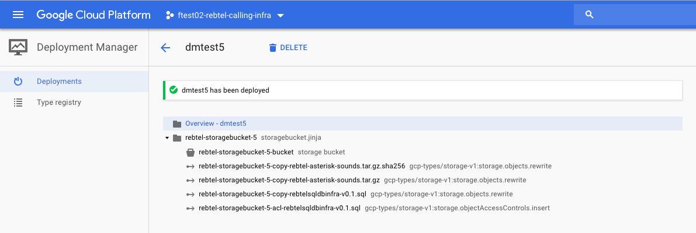

# Storage Bucket Rewrite & ACL

## Overview

This is a [Google Cloud Deployment
Manager](https://cloud.google.com/deployment-manager/overview) template that deploys a Cloud Storage Bucket and copies a list of files to it. I also use a DM `action` to add an ACL if a reader exist in the yaml file.



## Prerequsites

You need to grant 

- [roles/storage.admin](https://cloud.google.com/iam/docs/understanding-roles#cloud_storage_roles)  role
to the service account DM uses (```projectNumber@cloudservices.gserviceaccount.com```)

## Deploy the template

Use `storagebucket-acl-example.yaml` to deploy this example template. When ready, deploy with the following command:

```
gcloud deployment-manager deployments create dmtestbucket --config storagebucket-acl-example.yaml
```

**`storagebucket-acl-example.yaml`**

```
imports:
  - path: storagebucket-acl.jinja

resources:
  - name: my-storagebucket
    type: storagebucket-acl.jinja
    properties:
      region: us-central1
      storageClass: REGIONAL
      sourceBucket: my-test-bucket-source
      sourceObjects:
        - file: testfile1.tar.gz.sha256
        - file: testfile1.tar.gz
        - file: mydbdump-v0.1.sql
          reader: osm.hammami@gmail.com
```

### Deployment

```
# gcloud deployment-manager deployments create bucket-acl-test1 --config storagebucket-acl.yaml
The fingerprint of the deployment is rkbDpKDpFKkddSkeNaRXVQ==
Waiting for create [operation-1535445803546-5747ad5b33591-c3b99e20-f626ebdf]...done.
Create operation operation-1535445803546-5747acxb13591-c3b90e20-f626ebdf completed successfully.

NAME                                                                 TYPE                                                      STATE      ERRORS  INTENT
rebtel-storagebucket-acl1-acl-rebtelsqldbinfra-v0.1.sql        gcp-types/storage-v1:storage.objectAccessControls.insert  COMPLETED  []
rebtel-storagebucket-acl1-bucket                               storage.v1.bucket                                         COMPLETED  []
rebtel-storagebucket-acl1-copy-testfile1.tar.gz                gcp-types/storage-v1:storage.objects.rewrite              COMPLETED  []
rebtel-storagebucket-acl1-copy-testfile1.tar.gz.sha256         gcp-types/storage-v1:storage.objects.rewrite              COMPLETED  []
rebtel-storagebucket-acl1-copy-mydbdump-v0.1.sql               gcp-types/storage-v1:storage.objects.rewrite              COMPLETED  []
```

## References

* [Supported Resource Types](https://cloud.google.com/deployment-manager/docs/configuration/supported-resource-types)
* [ObjectAccessControls](https://cloud.google.com/storage/docs/json_api/v1/objectAccessControls#resource)
* [Cloud Storage Documentation: Objects rewrite](https://cloud.google.com/storage/docs/json_api/v1/objects/rewrite)
* [Infrastructure as Code on Google Cloud Platform](https://medium.com/google-cloud/infrastructure-as-code-on-google-cloud-platform-beginning-templates-68882e68d666)
