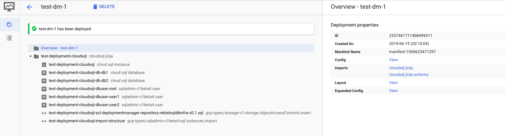

# Cloud SQL DB Import

## Overview

This is a [Google Cloud Deployment Manager](https://cloud.google.com/deployment-manager/overview) template that
deploys a Cloud SQL Master instance and creates a list of databases and users.

I use a DM `action` to:

* Add an object Access Controls to the SQL dump file with the created cloudsql service account.
* Import structure to the instance from Google Storage bucket.




> Note, CloudSQL does not allow parallel updates to the User, Databases table.

## Prerequsites

You need to grant the following roles to the service account that DM uses (```projectNumber@cloudservices.gserviceaccount.com```)

- [roles/cloudsql.admin](https://cloud.google.com/iam/docs/understanding-roles#sql_name_short_roles) 

- [roles/storage.legacyObjectOwner](https://cloud.google.com/storage/docs/access-control/iam-roles#legacy-roles)

The template will take care of adding the needed `READER` permission to the sql file used for the import.

## Deploy the template

Use `cloudsql.yaml` to deploy this example template. When ready, deploy with the following command:

```
gcloud deployment-manager deployments update test-dm-1 --config cloudsql_example.yaml
```

**`cloudsql_example.yaml`**

```
#
#  title: CloudSQL
#  author: osm.hammami@gmail.com
#  description: |
#    Creates a CloudSQL deployment
#  version: 0.2

imports:
  - path: cloudsql.jinja

resources:
  - name: test-deployment
    type: cloudsql.jinja
    properties:
      cloudsql:
        databaseVersion: MYSQL_5_7
        region: europe-west3
        tier: db-f1-micro
        dataDiskSizeGb: 10
        dataDiskType: PD_SSD
        zone: europe-west3-a
        backupStartTime: 09:00
        privateNetwork: default
        authorizedNetworks:
        - name: home-network
          value: 192.168.1.1/32
      sqlimport:
        bucket: bucket-repository
        file: sql-dump.sql
      failover: false
      databases:
      - name: db1
        charset: utf8
      - name: db2
        charset: utf8
      dbusers:
      - user: root
        host: '%'
        password: mySuperSafePassword
      - user: user1
        host: '%'
        password: mySuperSafePassword
      - user: user2
        host: '%'
        password: mySuperSafePassword
      databaseFlags:
      - name: log_bin_trust_function_creators
        value: 'On'
      - name: default_time_zone
        value: '+00:00'
```

### Deployment

```
# gcloud deployment-manager deployments update test-dm-1 --config cloudsql_example.yaml

NAME                                                                                 TYPE                                                      STATE      ERRORS  INTENT
test-deployment-cloudsql                                                             sqladmin.v1beta4.instance                                 COMPLETED  []
test-deployment-cloudsql-acl-deploymentmanager-repository-rebtelsqldbinfra-v0.1.sql  gcp-types/storage-v1:storage.objectAccessControls.insert  COMPLETED  []
test-deployment-cloudsql-db-db1                                                      sqladmin.v1beta4.database                                 COMPLETED  []
test-deployment-cloudsql-db-db2                                                      sqladmin.v1beta4.database                                 COMPLETED  []
test-deployment-cloudsql-dbuser-root                                                 sqladmin.v1beta4.user                                     COMPLETED  []
test-deployment-cloudsql-dbuser-user1                                                sqladmin.v1beta4.user                                     COMPLETED  []
test-deployment-cloudsql-dbuser-user2                                                sqladmin.v1beta4.user                                     COMPLETED  []
test-deployment-cloudsql-import-structure                                            gcp-types/sqladmin-v1beta4:sql.instances.import           COMPLETED  []
```

### References

* [API reference Cloud SQL v1beta4](https://cloud.google.com/sql/docs/mysql/admin-api/v1beta4/)
* [API explorer Cloud SQL v1beta4](https://developers.google.com/apis-explorer/#p/sqladmin/v1beta4/)
* [CloudSQL Testing Framework](https://github.com/GoogleCloudPlatform/deploymentmanager-samples/tree/master/examples/v2/cloudsql)
