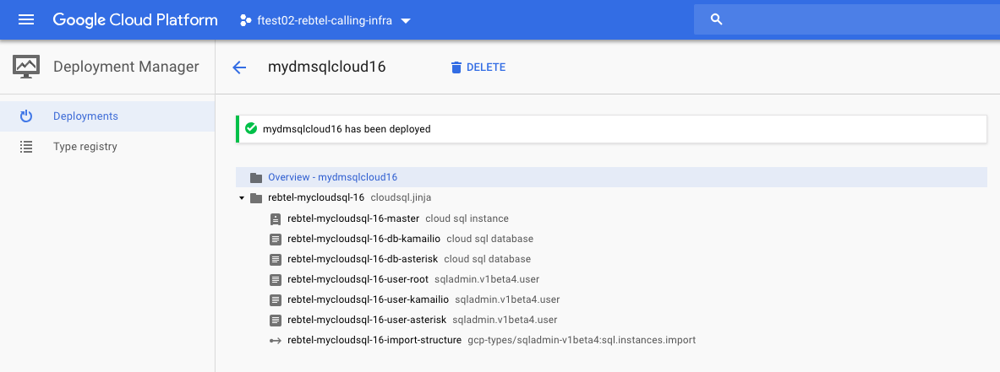

# Cloud SQL DB Import

## Overview

This is a [Google Cloud Deployment
Manager](https://cloud.google.com/deployment-manager/overview) template that
deploys a Cloud SQL Master instance and create a list of databases and users. I also use a DM `action` to
import structure to the instance from Google Storage bucket.



> Note, CloudSQL does not allow parallel updates to the User table

## Prerequsites

You need to Share publicly the sql file in your bucket.

You need to grant 

- [roles/cloudsql.admin](https://cloud.google.com/iam/docs/understanding-roles#sql_name_short_roles)  role
to the service account DM uses (```projectNumber@cloudservices.gserviceaccount.com```)

## Deploy the template

Use `cloudsql_example.yaml` to deploy this example template. When ready, deploy
with the following command:

```
gcloud deployment-manager deployments create my-database --config cloudsql_example.yaml
```

**`cloudsql_example.yaml`**

```
imports:
  - path: cloudsql.jinja

resources:
  - name: rebtel-mycloudsql-16
    type: cloudsql.jinja
    properties:
      region: us-central1
      zone: us-central1-a
      dataDiskSizeGb: 15
      sqlimportstructure: gs://mydeploymentmanager-repository-example/sqldump-export-v0.1.sql
      rootpass: myrootsupersafepas
      machinetype: db-f1-micro
      databases:
        - name: dbname1
        - name: dbname2
          charset: latin2
      users:
        - name: username1
          password: mysupersafepass1
          host: "44.33.22.11"
        - name: username2
          password: mysupersafepass2
      authorization:
        - name: ip-test-01
          network: 11.22.33.44/32
        - name: ip-test-02
          network: 55.66.77.88/24
```

### Deployment

```
# gcloud deployment-manager deployments create mydmsqlcloud16 --config cloudsql.yaml
The fingerprint of the deployment is iBtGCTEDiLeGZogkxehXkA==
Waiting for create [operation-1531767208303-5712258545998-5d41e537-f5b748d9]...done.
Create operation operation-1531767208303-5712258545998-5d41e537-f5b748d9 completed successfully.
NAME                                   TYPE                                             STATE      ERRORS  INTENT
rebtel-mycloudsql-16-db-dbname1        sqladmin.v1beta4.database                        COMPLETED  []
rebtel-mycloudsql-16-db-dbname2        sqladmin.v1beta4.database                        COMPLETED  []
rebtel-mycloudsql-16-import-structure  gcp-types/sqladmin-v1beta4:sql.instances.import  COMPLETED  []
rebtel-mycloudsql-16-master            sqladmin.v1beta4.instance                        COMPLETED  []
rebtel-mycloudsql-16-user-username1    sqladmin.v1beta4.user                            COMPLETED  []
rebtel-mycloudsql-16-user-username2    sqladmin.v1beta4.user                            COMPLETED  []
rebtel-mycloudsql-16-user-root         sqladmin.v1beta4.user                            COMPLETED  []
```

## References

* [Services > Cloud SQL Administration API v1beta4 > sql.instances.import](https://developers.google.com/apis-explorer/#p/sqladmin/v1beta4/sql.instances.import)
* [Cloud SQL Example](https://github.com/GoogleCloudPlatform/deploymentmanager-samples/tree/master/examples/v2/sqladmin)
* [Supported Resource Types](https://cloud.google.com/deployment-manager/docs/configuration/supported-resource-types)
* [Access control for Deployment Manager](https://cloud.google.com/deployment-manager/docs/access-control#access_control_for_deployment_manager)
* [Cloud storage objects Action to upload ](https://github.com/GoogleCloudPlatform/deploymentmanager-samples/issues/40)