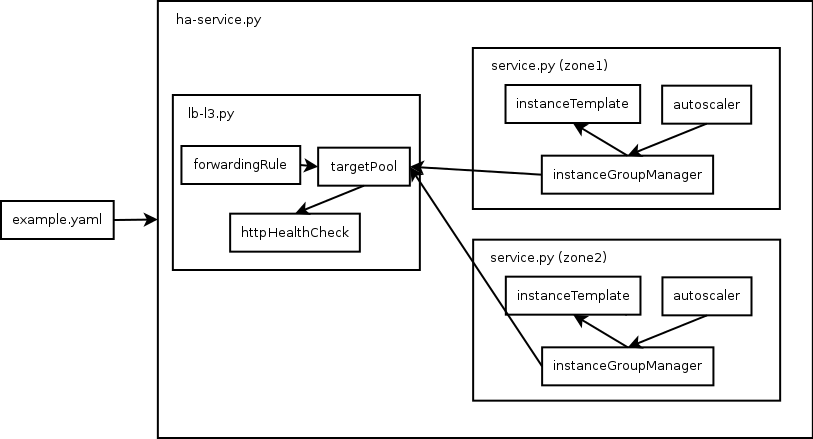

# High-availability Service

## Overview
This is a [Google Cloud Deployment
Manager](https://cloud.google.com/deployment-manager/overview) template which
deploys a load balanced high-availability service to multiple zones in a single
region. It makes use of the [Container VM
image](https://cloud.google.com/compute/docs/containers/container_vms) to run
your Docker container in an autoscaled instance group within each zone and uses
a network load balancer to balance across all zones.

## Properties
The HA service takes the following input properties:

* `dockerImage`: the docker image to run on the Container VMs in the service. It
  should be an image which exposes a service on a port specified by the `port`
  property.
* `port`: the port exposed from the docker image, as well as the port exposed by
  the load balancer.
* `zones`: the list of zones to run the service in. These must all be within the
  same region.

For more details on properties of this template, see the [template
schema](ha-service.py.schema).

## Architecture
The template architecture for this configuration looks like this:

```
example.yaml
 |
 |- ha-service.py
     |
     |- lb-l3.py
     |
     |- service.py (zone1)
     |
     |- service.py (zone2)
     |
    ...
     |- service.py (zoneN)
```

The resulting architecture of Google Cloud Platform resources looks like this:



