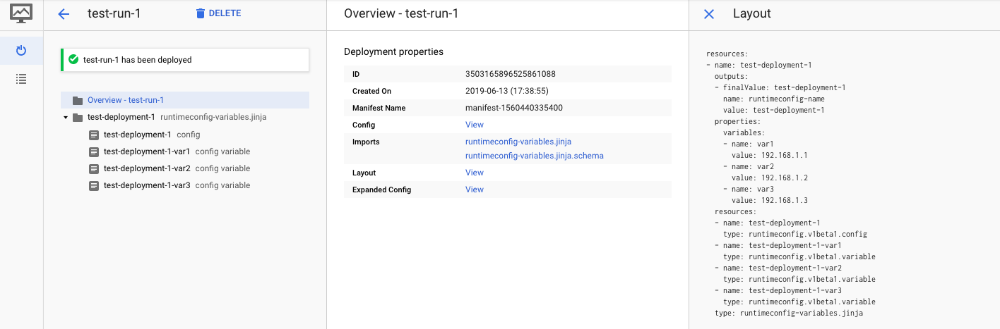
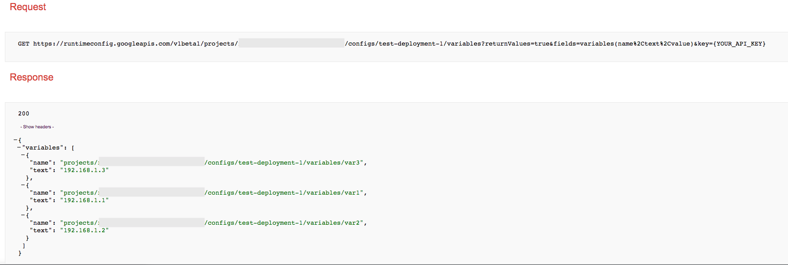

# Cloud Runtime Configuration template

## Overview

This is a [Google Cloud Deployment Manager](https://cloud.google.com/deployment-manager/overview) template that deploys a [RuntimeConfig](https://cloud.google.com/deployment-manager/runtime-configurator/) resource, and a list of [Variables](https://cloud.google.com/deployment-manager/runtime-configurator/set-and-get-variables) that belong to the created RuntimeConfig resource.



## Notes for API explorer Runtime Configurator

To create a configuration ressource:

* parent: `projects/[PROJECT ID]`
* name: `projects/[PROJECT ID]/configs/[CONFIG NAME]`

To create a variable in a configuration ressource:

* parent: `projects/[PROJECT ID]/configs/[CONFIG NAME]`
* name: `projects/[PROJECT ID]/configs/[CONFIG NAME]/variables/[VARIABLE NAME]`

## Deploy the template

Use `runtimeconfig-variables.yaml` to deploy this example template. When ready, deploy with the following command:

```
gcloud deployment-manager deployments create test-run-1 --config runtimeconfig-variables.yaml
```

**`runtimeconfig-variables.yaml`**

```
#  title: Runtime Config Variables
#  author: osm.hammami@gmail.com
#  description: |
#    Creates a RuntimeConfig with a list of variables that belong to the created RuntimeConfig  resource.
#  version: 0.1

imports:
  - path: runtimeconfig-variables.jinja

resources:
  - name: test-deployment-1
    type: runtimeconfig-variables.jinja
    properties:
      variables:
      - name: var1
        value: 192.168.1.1
      - name: var2
        value: 192.168.1.2
      - name: var3
        value: 192.168.1.3
```

### Deployment

```
# gcloud deployment-manager deployments create test-run-1 --config runtimeconfig-variables.yaml
The fingerprint of the deployment is jAyjD2rn7l0wI3U2QDaykQ==
Waiting for create [operation-1560440335333-58b3653e176e6-f0e46ede-3dc9d076]...done.
Create operation operation-1560440335333-58b3653e176e6-f0e46ede-3dc9d076 completed successfully.
NAME                    TYPE                            STATE      ERRORS  INTENT
test-deployment-1       runtimeconfig.v1beta1.config    COMPLETED  []
test-deployment-1-var1  runtimeconfig.v1beta1.variable  COMPLETED  []
test-deployment-1-var2  runtimeconfig.v1beta1.variable  COMPLETED  []
test-deployment-1-var3  runtimeconfig.v1beta1.variable  COMPLETED  []
```
To check the deployment use the [runtimeconfig.projects.configs.variables.list](https://developers.google.com/apis-explorer/#p/runtimeconfig/v1beta1/runtimeconfig.projects.configs.variables.list) with the parent exported as an output in the deployment.

#### Request

* parent: `projects/[PROJECT ID]/configs/test-deployment-1`
* returnValues: `true`
* fields: `variables(name,text,value)`



## References

* [API reference RuntimeConfig](https://cloud.google.com/deployment-manager/runtime-configurator/reference/rest/)
* [API explorer RuntimeConfig v1beta1](https://developers.google.com/apis-explorer/#p/runtimeconfig/v1beta1/)